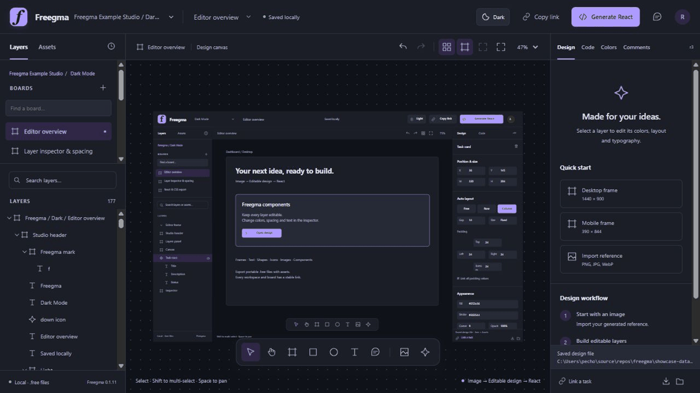
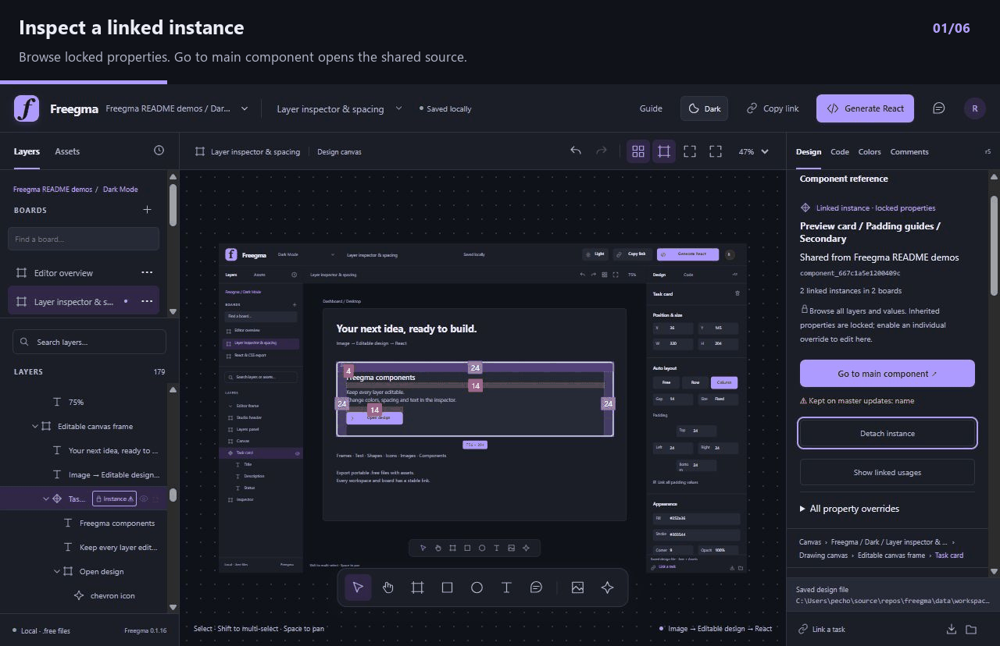
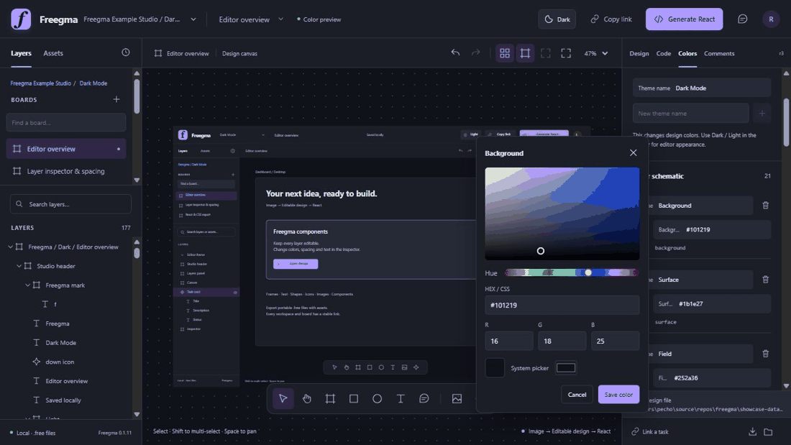
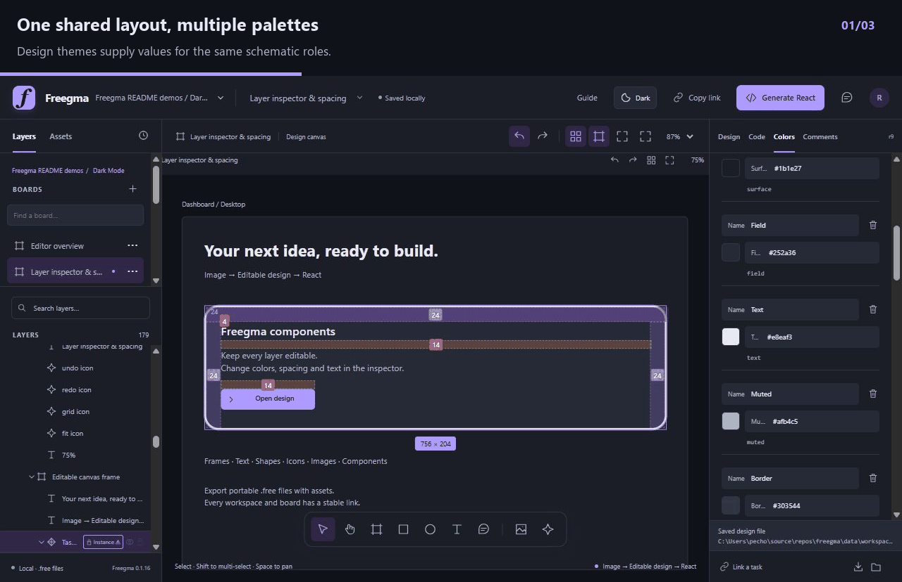
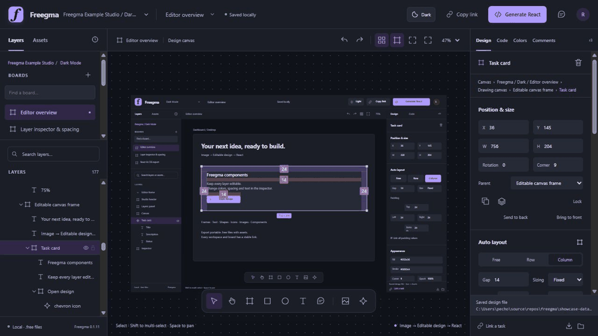
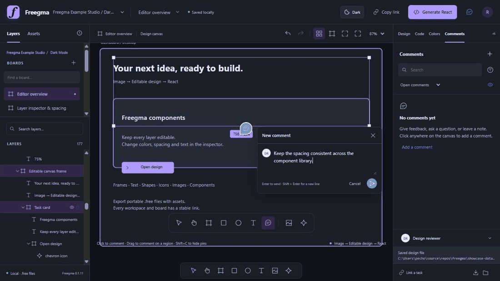

<div align="center">

<a href="https://freegma-theta.vercel.app"></a>

# Freegma

**Your designs. Your files. Your workflow.**

Editable canvas · Components · Real CSS · Portable workspaces · MCP

**Reference image → Editable design → React implementation**



</div>

## Quick start

Install **Node.js 24.14 or newer** and Yarn. Node includes the SQLite runtime; no separate database server is required.

```sh
git clone https://github.com/Vreckovka/freegma.git
cd freegma
corepack enable
yarn install
yarn build
yarn start
```

Open **http://127.0.0.1:4330**. After installation the workflow is **`yarn build` → `yarn start`**. The server runs in your terminal; Ctrl+C stops it. `yarn test` checks editor/storage/export/comments/colors/MCP. Yarn and dependencies are pinned in `package.json` and `yarn.lock`. This private repository requires access to clone.

Freegma runs independently of task dashboards, worker clients and external accounts.

## Feature tour

### Trace every shared component

Layers label **Master** and **Instance**. Select an instance or its child to see the owning project, stable component ID and linked usages. **Go to main component** jumps to its source. Saved master edits update uses across boards and theme folders automatically, while local overrides stay yours. Instances are read-only until you click a property’s lock to enable its local override. An orange warning and Reset control show which values are preserved. Browse layers freely; use All property overrides for individual native properties or CSS declarations. The starter template includes two linked Cards and Buttons to try this.

1. Insert from **Assets → Components** to create a linked use.
2. Select it in Layers: the lock means inherited properties are read-only. **Go to main component** opens the source.
3. Edit the master once; linked uses update automatically across boards and theme folders.
4. Click a property’s lock to enable only that local override. The orange warning means it is kept on master updates. **Reset** follows the latest master again.



The editable Freegma Studio example shares its controls and preview cards from a parent library. [Folders, themes and component guide](docs/projects-and-themes.md).


### Color roles: change text and borders together

A **schematic** is the project’s list of named color roles, such as Background, Text, Border and Accent. Each **theme** supplies a value for every role. Parent projects share their schematic and themes with child folders.

Choose a layer property’s **Color role** to link it, or keep **Local color** for an independent value. One role can feed several properties: in this demo, **Text** drives both primary text and the preview card’s outline. Changing Text turns both mint green; the background and muted text stay unchanged.

Open **Colors**, pick the role’s swatch, then drag or enter HEX/RGB. The open board previews locally; **Save color**, closing the picker or changing workspace accepts one action. Escape cancels. **Ctrl+Z** restores the accepted color in one step. Other boards resolve saved roles when opened. Switching **Design theme** changes the same components without duplicating them.





Both side panels collapse with their corner chevron. Drag the inner edge to resize, or focus the divider and use arrow keys. Layers has a 200 px minimum and the inspector 248 px; double-click resets its width. Widths and collapse preferences are saved locally, independently of designs. Narrow windows temporarily fold panels to preserve canvas space.

### Layers, spacing, and real CSS

Edit native layers through the canvas or tree. Change text, geometry, padding, margins, gap, alignment and sizing. For a shared component, edit the **master**, or explicitly override the instance property first. Generate JSX + CSS, edit CSS and apply it back to the design; the same property locks apply. Copy or download files named after the component. The recording edits master CSS so linked uses inherit the change.



### Feedback on the canvas

Pin comments or drag a region. Reply, react, resolve, search, filter and copy thread links. Anchored pins follow their frame and stay readable while zooming. Comments survive design Undo.



| Design | Organize | Hand off |
| --- | --- | --- |
| Frames, shapes, text, icons, vectors, images | Parent folders, workspaces, boards | JSX and CSS copy/download |
| Auto layout, padding, gap, margins, guides | Linked components and independent templates | Portable `.free` packages with assets |
| Local colors and themed roles | Persistent Undo/Redo and stable links | MCP reads, guarded edits and exports |
| Light and dark appearance | Pinned comments and region feedback | Optional task ID/URL reference |

Animations are captioned snapshots of real editor edits in an isolated copy of its studio designs. Captions identify the component, role or CSS operation being demonstrated. Generated React is a visual scaffold; implementation adds behavior and application data.

Undo design edits with **Ctrl+Z** (or **Cmd+Z** on macOS), including property fields and color edits. Redo with **Ctrl+Shift+Z** or **Ctrl+Y**. Text, CSS and comment editors keep their normal text Undo.

### Keep editing while Freegma saves

Canvas edits appear immediately. Completed moves, property changes and flow edits save in the background after a 500 ms quiet period, with a two-second maximum wait before an available request starts. Each request contains at most 25 completed actions or 1,000 operations; size and unsaved backlog limits prevent unlimited accumulation. Only one request runs at a time. A slow request can extend the wait for the next batch, while editing continues.

The subtle header shows scheduled/saving progress and a check when saved. Newer local edits stay on top of save acknowledgements. Each completed action remains a separate Undo step. Navigation and exports include pending edits. If saving fails or another editor conflicts, your draft remains visible: **Retry** resends the same batch safely, and **Copy unsaved edits** preserves the draft for recovery. Leaving with unsaved changes triggers the browser’s normal confirmation.

## Editable examples

Open **Guide** in the editor for a short folders/components/color-themes walkthrough with an interactive example. **Workspace menu → New project** offers Empty or a Light & Dark template: one shared Button/Card library, example boards, both palettes and optional theme folders. Parent components are available in children; theme-only extras stay local. See [projects and themes](docs/projects-and-themes.md).

[**Freegma-Studio.free**](examples/Freegma-Studio.free) is a portable example project containing **editable designs of Freegma itself**. A board is one canvas document; “native” means its text, frames, icons and layout are separate Freegma layers you can select and inspect.

It contains **11 screen examples**, each shown in Light Mode and Dark Mode: **22 screen boards**, plus **Shared studio components**—**23 boards in total**. The parent library has **14 shared component masters** used by those screens. The file also carries their color roles, themes and independent starting templates.

```text
Freegma Example Studio
  Shared studio components     masters reused by the screens
  Light Mode                   11 screen examples
  Dark Mode                    the same 11 examples in dark colors
```

These two sets are visual reference examples. For your own product, keep one set of shared components and boards, and switch their **Design theme**; use theme folders only for special extras.

Import the `.free` file from the workspace menu, or run:

```sh
yarn examples
yarn start
```

Overview, inspector/spacing, React/CSS, components, folders, dialogs/history, foundations and portable/import views are all editable. `yarn examples` preserves existing example edits. `node scripts/export-examples.mjs` rebuilds the distributable example from native design sources.

For a smaller hands-on tutorial, import [**Freegma-Feature-Tour.free**](examples/Freegma-Feature-Tour.free). It has **four boards**: Start here, Shared studio components, and one inspector screen in each theme folder. The card outline is deliberately bound to **Text**, so you can repeat the text-and-border color demo. Master edits and property overrides work as shown in the recordings.

The screenshot sources and captions for the README are in `docs/media/source/` and `docs/media/demos.json`. Optional documentation tooling: install Pillow in your Python environment, then run `python scripts/build-readme-media.py` to rebuild the GIFs. This is independent of `yarn build` and `yarn start`.

Project navigation reads lightweight workspace and board names, then loads the selected board. Assets loads the component library when opened. The canvas mounts visible frames with a nearby buffer; offscreen designs remain saved and appear as you pan. External edits use small revision checks and reload the active board only when it changes.

## Files belong to you

```text
freegma/
  client/                  React editor
  server/                  HTTP + MCP + storage
  shared/                  Scene, CSS, colors, comments, templates
  dist/                    Built editor (ignored)
  data/                    Private local storage (ignored)
    freegma.sqlite         Rebuildable file-reference index
    workspaces/
      workspace_ID/
        workspace_ID.free  Palette, library, references
        b/board_ID.free     Layout, styles, history, comments
        Assets/            Original images
```

SQLite stores references, not design documents. `/w/workspace_ID/b/board_ID` maps to its `.free` file. Portable exports bundle assets, library and settings so they can travel alone. For a filesystem move, stop editors and copy the entire workspace folder. IDs and URLs survive a move; import collisions generate new IDs without overwriting designs. See the [editor guide](docs/editor-guide.md).

Large `.free` boards, manifests and downloads use lossless compression. The outer file is JSON with `format: "freegma-packed"`, `encoding: "gzip-base64"`, the original content type and expanded byte count. Its payload contains the complete native JSON, including every Undo snapshot, layout, component reference, flow route, comment and theme. Assets keep their original bytes. Small files stay ordinary JSON, and files generated as ordinary native JSON still import normally. The expanded portable package limit remains 128 MB; malformed or oversized packed files are rejected before writing.

Agents can keep creating native JSON and using atomic MCP operations. `freegma_export_file` returns readable native JSON by default; set `compact: true` for a smaller transferable package. Browser `.free` downloads use the compact format automatically. To inspect a compressed file or repack one locally:

```sh
node scripts/free-file.mjs unpack input.free readable.free
node scripts/free-file.mjs pack readable.free smaller.free
```

Both commands preserve the input and refuse to overwrite an existing output. Existing storage files become compact when next saved. For a one-time migration, first ensure **all HTTP and MCP processes** use this version, then run `node scripts/compact-files.mjs /absolute/path/to/new-backup-directory`. It takes the storage lock for each file, backs up its exact original bytes, publishes through the normal crash recovery journal, and preserves revisions, Undo/Redo, images and recoverable deleted workspaces.

Local performance comparisons include `.free` board/manifests, portable examples, original assets, the SQLite index, production build, source, README media and development dependencies. Capture sizes **before** an optimization, then measure the same frozen documents afterward. The scripts refuse to replace an existing baseline or measured run:

```sh
node scripts/performance/snapshot-sizes.mjs logs/my-size-baseline
node scripts/performance/file-sizes.mjs logs/my-size-baseline round-01
# Append its size rows to an existing local timing comparison:
node scripts/performance/compare.mjs logs/my-performance round-01 logs/my-size-baseline/round-01.json
```

The original timing baseline remains unchanged. A size metric added later names its separate capture rather than inventing an earlier measurement. Recovery archives stay separate from active workspace size; database/WAL size can vary while editing. These benchmarks never call Vercel.

## MCP

Use `yarn mcp` or configure your agent with an absolute Node executable and `server/mcp.mjs`. HTTP and MCP share storage and optimistic revisions.

For smaller AI context, use `freegma_get_board` with `view:"outline"` to find IDs, then `view:"nodes", nodeId:"frame-id"` to inspect only that frame. Reads are paginated and retain revision checks. Board mutations accept `responseMode:"compact"` for a small revision receipt instead of returning every layer again. Existing full responses remain available. The local comparison table now includes MCP payload tokens and bytes; see [MCP workflow and benchmark](docs/MCP-PERFORMANCE.md).

Large HTTP responses use negotiated compression. Unchanged editor files can be revalidated without downloading their bodies again; live API/save responses stay fresh. See the [local network benchmark and caching behavior](docs/NETWORK-PERFORMANCE.md).

```json
{"mcpServers":{"freegma":{"command":"/absolute/path/to/node","args":["/absolute/path/to/freegma/server/mcp.mjs"]}}}
```

There are **31 tools** for projects, workspaces, boards, flows, deletion previews, operations, components, images, CSS/React, portable files, colors, comments, task references and Undo/Redo. Use `freegma_create_project` with `template: "empty"` or `"light-dark"`. Read current revisions before editing. Logs use stderr; stdout remains JSON-RPC.

## Flows: designs plus product logic

Choose **Workspace menu → New Flows workspace**. Add a **Frame** by choosing its design workspace, board and frame. Add **If**, **Repeat** and **End** steps, then select a step, choose **Connect**, and click the next step. Output/input ports also create connections.

[Editable feature mockups](examples/Flows-Feature.free) include the canvas, frame picker and transition inspector as three native design frames. Import this `.free` package to browse or edit the feature designs.

Example: `Home → click Buy → Signed in? → Yes → Checkout → Submit → End: Order confirmed`. A No branch can lead to Sign in; a Repeat arrow returns to Home. Select an arrow to choose Straight / If / Repeat, enter a title and explanation, and pick the exact source button in **Trigger element**. Final states have their own explanation and no outgoing arrows.

Drag steps, pan the empty canvas, zoom with Ctrl+scroll, and undo/redo with Ctrl+Z / Ctrl+Shift+Z. **Open frame** selects the original design layer. Existing components, themes and design workspaces stay intact; nothing is automatically converted into a flow.

Flow workspaces use the same stable `/w/workspace_ID/b/board_ID` links, task references, recoverable deletion and portable `.free` files. The manifest has `type: "flows"`; boards store `document.flow` nodes and edges plus undo history. SQLite still indexes file references only. Frame and trigger references store workspace, board, frame and optional element IDs. Original designs export separately: import those source `.free` workspaces too when moving a flow to another system. Missing sources are reported and can be replaced in the inspector; diagrams remain editable.

MCP: `freegma_create_flow_workspace({name})`, `freegma_flow_sources({boardId,frameId?})`, and `freegma_apply_flow({boardId,expectedRevision,operations})`. Operations add/update/remove nodes or edges atomically. Node kinds: frame / if / repeat / end. Edge actions: straight / if / repeat. Frame nodes require a `reference`; arrow `trigger` elements must belong to their source frame. Use the existing board read, Undo/Redo, export/import and task-link tools. Restart an already-running MCP connection after updating Freegma to discover the new tools.

Delete a board from its **⋯** menu in the Boards list. To delete a project/workspace, open the workspace dropdown and choose **Delete workspace…**. The confirmation shows the scope and requires the exact name. Deleting a parent includes its children; deleting a board keeps shared library components and assets. Changed designs invalidate old confirmations.

Deleted files are retained in `data/workspaces/.trash/deletion_ID/`, including a `deletion.json` inventory. To recover, stop all Freegma HTTP/MCP clients and copy the archived files back to their original relative paths; for an individual board, add its `{id,path:"b/board_ID.free"}` reference to the workspace manifest. If the manifest is packed, unpack it with `scripts/free-file.mjs` before editing its JSON. Avoid overwriting newer files. Restart Freegma to rebuild the SQLite index. Deletion is separate from canvas Undo.

## Configuration and embedding

Defaults need no configuration. Set variables in your shell/service; `.env.example` documents them but is not loaded automatically.

| Variable | Default / purpose |
| --- | --- |
| `FREEGMA_PORT` | `4330` |
| `FREEGMA_DATA_DIR` | `<repository>/data` |
| `FREEGMA_DB` | `<data>/freegma.sqlite` |
| `FREEGMA_WORKSPACES` | `workspaces` beside the index |
| `FREEGMA_BUILD` | `<repository>/dist` |
| `FREEGMA_ORIGIN` | Base URL for MCP links |
| `FREEGMA_EMBED_ORIGINS` | Comma-separated frame origins; default local ports 4320/4318 |

Embed by iframe in a permitted host. Navigation sends `{type:"freegma:navigate",path:"/w/…/b/…"}` to the referrer's origin; hosts check sender origin and iframe window. A task reference is plain optional metadata.

The server binds to loopback and checks API origins. Comment identities are local display labels. Public access is opt-in; allowed public origins use the same editable local studio.

### Instant Back and recent editing steps

Recent boards stay in this browser tab's memory for five minutes, with a limit of ten boards / 32 MiB of board documents. Back restores the canvas position, zoom, selection and layer tree. The normal lightweight revision checks refresh an idle board when its design, comments or color scheme changes. Unchanged boards do not download their full document again. Reloading the browser clears this memory cache; your saved `.free` files remain authoritative.

Each board keeps its own background save queue. You can switch boards while completed actions save; a reply for the old board never replaces the new canvas. Pending drafts survive cache eviction until saved. Up to eight boards may have pending edits; failures show **Save paused**, **Retry**, and **Copy unsaved edits** for all affected boards. Closing the tab with pending edits triggers the browser's normal unsaved-work warning.

**Ctrl+Z**, **Ctrl+Shift+Z** and **Ctrl+Y** restore recent completed steps immediately and schedule their persistence with other edits. This cache retains up to twenty steps / 32 MiB per retained board for five minutes. Older steps and project color history use the server's original Undo/Redo path. Unfinished gestures and color previews do not create cached steps. A remote revision or palette change clears obsolete local history. Exports and shared-component/color operations still drain pending saves to keep their result consistent.

### Two flow views, shared editing tools

Use a **Flows workspace** for journeys between dashboards. Enable **Flow layer** on a design board for navigation inside that dashboard. Both support connector dots, Straight / If / Repeat arrows, Start / Decision / End points, trigger events, click-only details, movable endpoints and curve handles, and route pivots.

- **Linked frames:** choose **Live frame · locked master** to render the real design at its actual size, or **Context card** for a compact preview with a title and explanation. Existing cards keep their display. Both reference the original frame; edit its content in the source workspace and references refresh. Moving a live frame by its caption changes only its flow placement.
- **Connector dots:** drag near the same frame's boundary to reposition a dot. Attached arrows follow in one undoable action. Drag onto another frame or its connector to create an arrow. On a design board, outer frames show dots automatically; select a nested frame to reveal its dots.
- **Drop in space:** a draft line stays visible. Choose an existing target, add a Decision or End, or pick a frame reference. Escape cancels without changing saved history. Adding a point and its arrow is one undoable action.
- **Arrow editing:** hover to trace the arrow and its trigger; click for the description and Edit / Remove controls. Pick Click, Hover, State change or another event, and optionally the exact source button. Select the arrow to drag its endpoints, bends or whole route, add/remove diamond pivots, or restore automatic routing.

Flow artwork stays separate from implementation artwork and React export. `.free` files preserve references, connector positions, routes and history. Source designs travel separately from a Flows workspace export.

### Vercel with local storage

The separate Freegma Vercel project forwards **every request** through a public tunnel to `yarn start` on your computer. The editor, API, SQLite index, `.free` documents, assets and downloads are served by that local process. There is no cloud database copy. Keep the computer, Freegma terminal and tunnel terminal running. Anyone with the public URL can use this shared editor; comment names are display labels.

1. Build and start Freegma locally using `yarn build` and `yarn start`.
2. Run `cloudflared tunnel --url http://127.0.0.1:4330 --http-host-header 127.0.0.1:4330 --no-autoupdate` in its own terminal.
3. Set `FREEGMA_PUBLIC_ORIGINS` to the exact public Freegma origin(s), and `FREEGMA_EMBED_ORIGINS` to the dashboard origins allowed to embed it, before starting the local server. Local iframe origins stay available. Alternatively set `FREEGMA_PUBLIC_CONFIG` to an absolute JSON file containing `{"origins":["https://your-freegma.vercel.app"],"embedOrigins":["https://your-dashboard.vercel.app"]}`; changes to this file reload without restarting the editor.
4. Set `FREEGMA_UPSTREAM` to the HTTPS tunnel origin. `node scripts/build-vercel.mjs` produces only Vercel routing configuration in `.vercel/output/`. Deploy that with `vercel deploy --prebuilt --prod` after linking the separate Freegma project.

The public path `/w/workspace_ID/b/board_ID` is identical to the local path. Integrations choose a local origin on local dashboard hosts and the public Freegma origin on public hosts. Cross-origin saves from unlisted sites remain rejected. If a quick tunnel is restarted, it gets a new URL: rebuild/redeploy the proxy with the new upstream. The stable Vercel URL stays the same.

`data`, `logs`, backups, local environment files and built editor files are excluded from deployment. See [Vercel external rewrites](https://vercel.com/docs/routing/rewrites) and [Build Output routing](https://vercel.com/docs/build-output-api/configuration).

### Flow layer on existing designs

Open any design board → **Flow layer** in the canvas toolbar → **＋ Transition**. Select the existing source frame, its triggering button (or frame state), and the target frame. Choose **Trigger event** (Click, Hover, Double click, Key press, Submit, Value change, Focus, Page load, State change or Timer). A small icon and event label appear with plain text centered above the arrow and in its click-opened details. Set Straight / If / Repeat independently, then add a short title and a longer description. For example: **Hover · Preview details** with an If action. These describe the flow; they do not run the interaction on the design. Saving an event change is one Ctrl+Z action and travels in the .free file. Older arrows infer Click when an element is linked, otherwise State change.

Arrows sit over the actual native frames. Hover an arrow or its title: the exact trigger lifts with a blue outline and the arrow turns amber. Click the arrow or its title to open a popup with the description, **Edit**, and **Remove**. The popup stays open until you close it or select another transition. Move frames, pan or zoom and the arrows follow. Turn the layer off to keep designing. Each saved edit is one Ctrl+Z action. The board’s `.free` file carries the flow layer; generated React contains only the artwork.

**Frame reference** adds a full-size linked frame from another workspace/board to this overlay, with a draggable Reference caption and an **Open original** link. Its native layers load only when visible and refresh when the source design or palette changes. Connect native frames and references, including exact source-button triggers. Reference removal leaves the source intact. Board exports store references; source designs travel separately. Separate **Flows workspaces** remain available for abstract charts. Feature mockups live in the Freegma project; this does not automatically map your product’s routes.

Try [Flow-Overlay-Example.free](examples/Flow-Overlay-Example.free): two example boards with actual canvas arrows and a linked source frame. [Flow-Overlay-Feature.free](examples/Flow-Overlay-Feature.free) contains eight editable feature mockups: canvas overlay, hover popup, transition editor, cross-board references, trigger icons/labels, native designs with flow-only symbols, draggable arrow routing, and pivots for both flow views.


**Move arrow endpoints and bends:** click the arrow line, or open its details and choose **Route**. Drag a circle to move the start/end attachment around its frame edge. Drag the squares to move the curve; a Repeat arrow has one square for its outside corner. Arrow keys move a focused handle by 10 design pixels (Shift: 1). The route previews locally while dragging, and release saves one undo step. **Escape** cancels a drag. **＋ Add pivot** adds a movable diamond waypoint; click one and choose **Remove pivot** to delete it independently. Select and drag the arrow line to shift its route while keeping endpoints attached. Both native flow layers and the separate Flows workspace support these controls; Flows keeps Add/Remove pivot and Reset route in the transition inspector. Repeat routes preserve their existing corners as editable pivots when the first pivot is added. **Reset route** restores the automatic path. Endpoints remain attached when frames move or resize; curve offsets follow their endpoints. Routing is saved in `.free`, supported by MCP, and excluded from React output.

MCP routing: `updateEdge` with `patch:{route:{from:{side:"right",offset:0.9},to:{side:"top",offset:0.5},controls:[{x:120,y:-200},{x:-120,y:-200}]}}`. Anchor offsets are fractions along Top/Right/Bottom/Left. Control offsets are design pixels relative to their respective start/end anchors. Use `pivots:[{x,y},...]` for up to 32 ordered world-space waypoints, and `via:{x,y}` for Repeat routes for a world-space outside corner. Send `route:null` to reset; use the board's current `expectedRevision`.

Use **Start**, **Decision**, and **End** in the Flow layer toolbar to add a start dot, decision diamond, or double-ring end marker. These belong to the flow layer and never become React design components. Drag a symbol to move it (or use Arrow keys; Shift adjusts by 1), click to edit its title/description, and remove it from its editor. Connect it through **Transition** using the From/To lists. Start has no incoming arrows; End has no outgoing arrows. A decision can have Yes and No arrows, and multiple arrows can converge on the same existing frame. Existing frames, dashboards and component frames remain the process steps; **Frame reference** brings in their original design from another board.

Example: **Start dot → Account frame → Withdrawal frame → Allowed? diamond → Yes → Amount frame → Balance frame → End marker**. A No branch can return to Withdrawal with Repeat. Repeat arrows leave the source bottom, go around the outside and enter the target side, including loops back to the same frame. Arrow labels have no background. Hover details, event icons, exact source-element highlighting, revisions, portable .free files and Ctrl+Z work across frames and flow symbols.

Import [Flow-Chart-Example.free](examples/Flow-Chart-Example.free) to try a complete flow layer with linked native designs, Start, an Allowed? decision, Yes/No branches, a merged End state and a bottom-to-side repeat arrow. The package includes its source designs and remaps those links on import.
